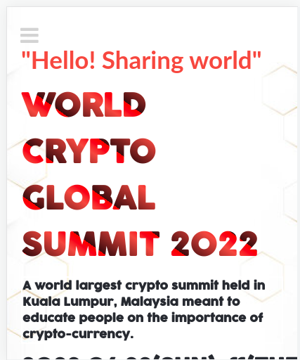
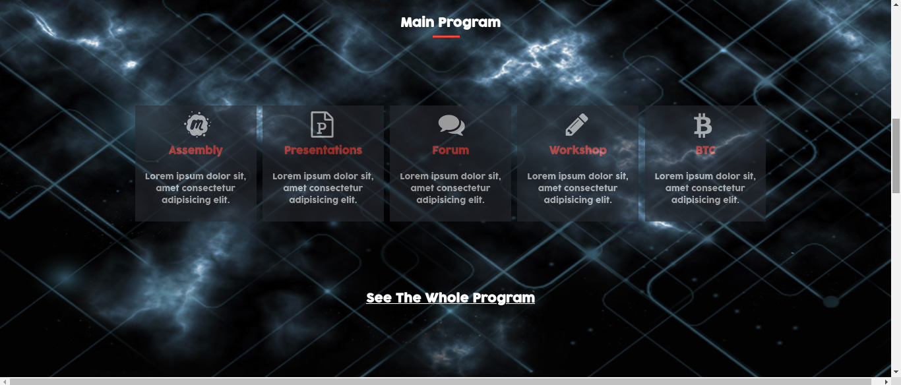
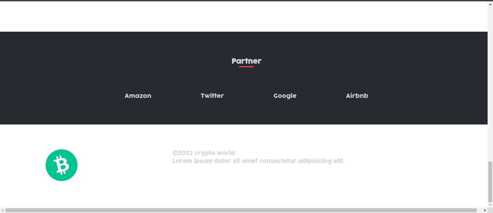
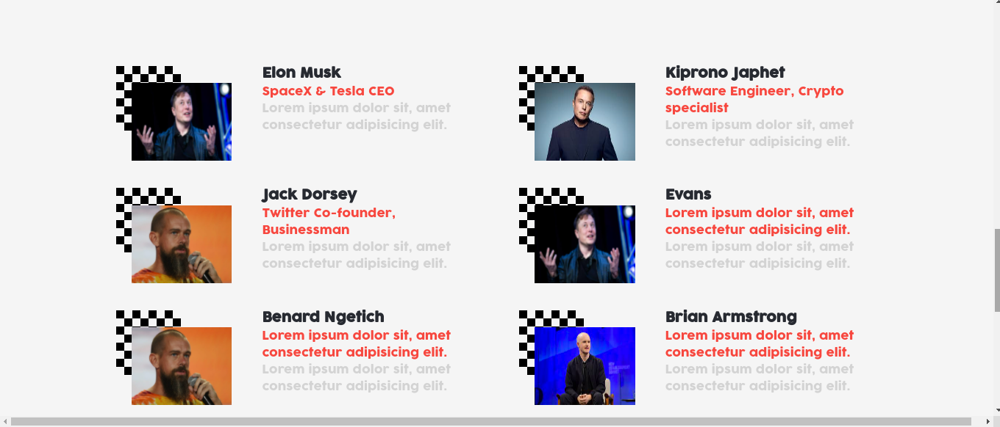
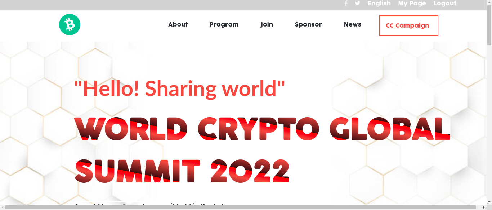

# Project Name

> World Crypto Summit-HTML/CSS & JavaScript capstone project - Conference page

## Built With

- HTML
- CSS
- Javascript
- Linters

**This is an documentation of world crypto summit project- HTML capstone project.**

## Live Demo

[Live Demo Link](https://ksigei.github.io/Crypto-Summit/)

## Getting Started

To get a local copy up and running follow these simple example steps.

Clone the repo to your local machine.

git clone https://github.com/ksigei/Crypto-Summit.git

cd portfolio2

## Author

- GitHub: [@ksigei](https://github.com/ksigei)
- Twitter: [@_kipronojaphet](https://twitter.com/@_kipronojaphet)
- LinkedIn: [@kiprono-japhet](https://www.linkedin.com/in/kiprono-japhet-85aab1220)

## 🤝 Contributing

Contributions, issues, and feature requests are welcome!

Feel free to check the [issues page](../../issues/).

## Show your support

Give a ⭐️ if you like this project!

## Acknowledgments

- Hat tip to anyone whose code was used
- Inspiration
- etc

## 📝 License

This project is [MIT](./MIT.md) licensed.